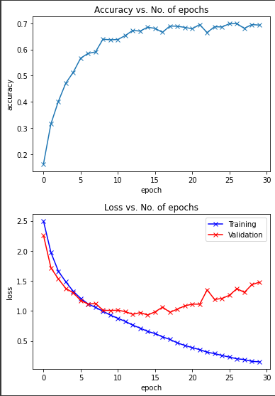

# Images-classification-model
Model was made as a task in the science club : AGH_RACING

## Model's basic documentation:
⚫ Dataset consists of 60000 photos. Training set consists of 50000 photos (83,33%) and testing set consists of 10000 photos (16,66%)

⚪ Model was based on AlexNet CNN. Some of the parameters were changed to the smaller values because of small image size and lower class count, than net was originally meant to be trained on. In the final version CIFAR-10 was used, however in the earlier version I used CIFAR-100, but due to poor performance (around 30% accuracy) I finally decided to change it to CIFAR-10. You can read more about AlexNet at the following link: - https://en.wikipedia.org/wiki/AlexNet

⚫ Model was trained by 30 epochs with batch consisted of 128 photos. The model predicts ten classes : ['airplane', 'automobile', 'bird', 'cat', 'deer', 'dog', 'frog', 'horse', 'ship', 'truck'] on the photos with accuracy around 70%. Images were resized to 64x64 pixels, because the original size of 32x32 pixel was too small to downsample through the passing layers and making them too large worsen the CNN accuracy.

## Model properties:

### Dataset is available under the following link:
  - https://www.cs.toronto.edu/~kriz/cifar.html
### Code with full documentation of the model was saved in Google Colab notebook and is available at the following link :
  - https://colab.research.google.com/drive/1luOLOArFflxP6PwKvhxUoTh3TTtHCCu1?usp=sharing
